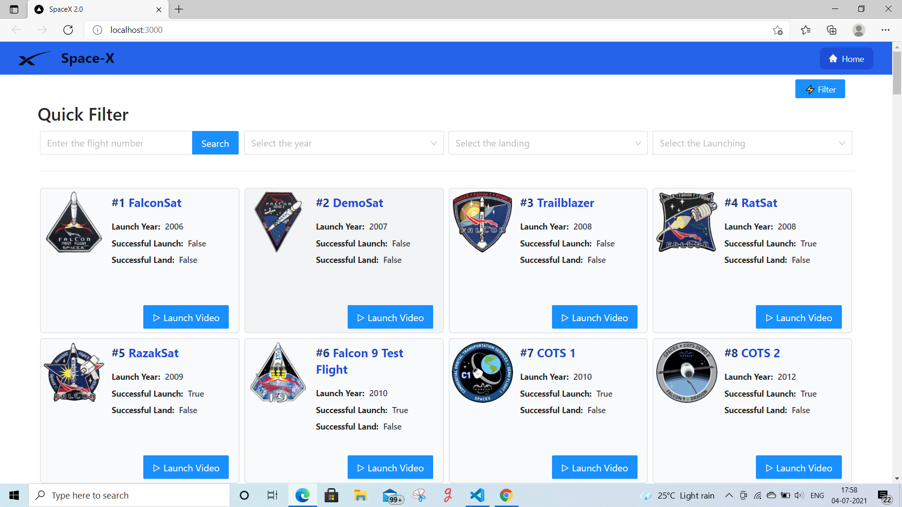
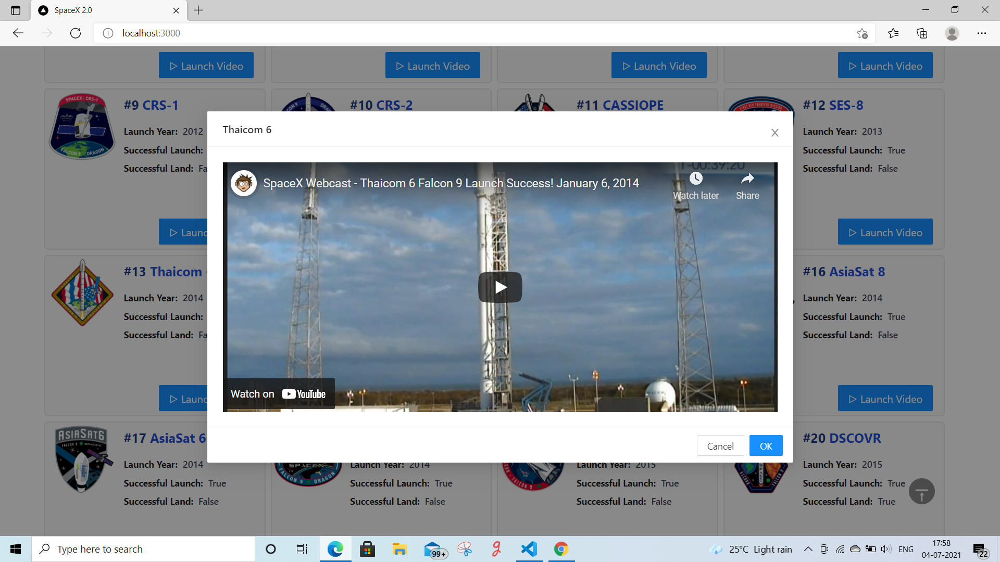
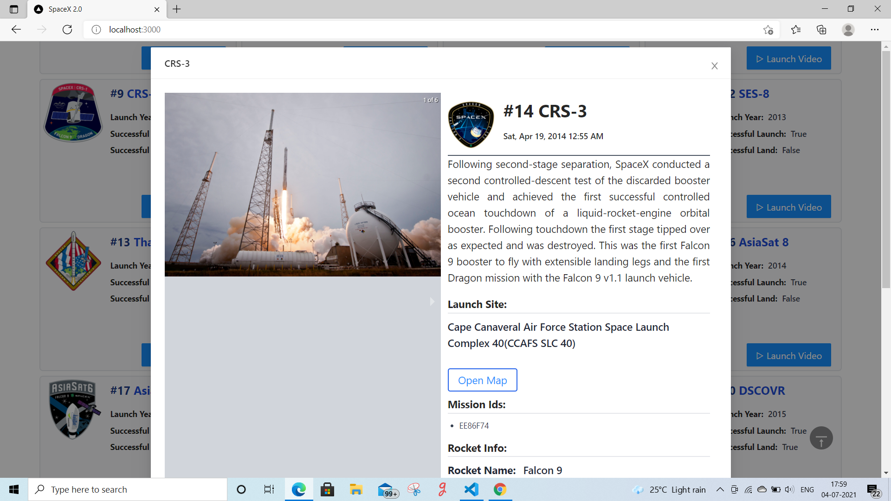
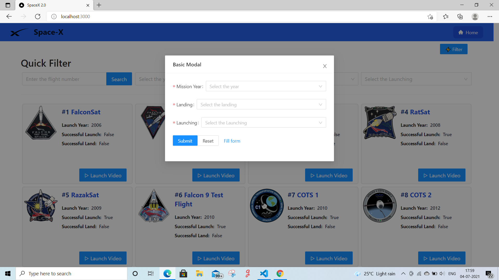

# spaceX-2.0-antDesign-nextjs-tailwindcss
This project is made with nextjs, tailwindcss and ant Design.

## Set Up

> STEP:1 Clone this repository by following command

```sh
$ https://github.com/jyotiprakash-m/spaceX-2.0-antDesign-nextjs-tailwindcss.git
$ cd spaceX-2.0-antDesign-nextjs-tailwindcss
```
> STEP:2 Then install all the dependencies using below command

```sh
$ npm install 

```
> STEP:3 Now you all set . To run the application use below command

```sh
$ npm run dev

```
## Screenshots
Some Screenshots of the project







## Live on
I host this application on vercel.com .

> [https://spacex-2.vercel.app](https://spacex-2.vercel.app/)
